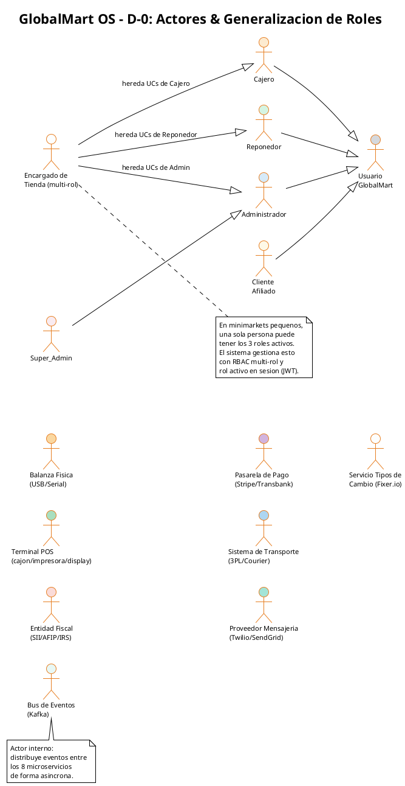
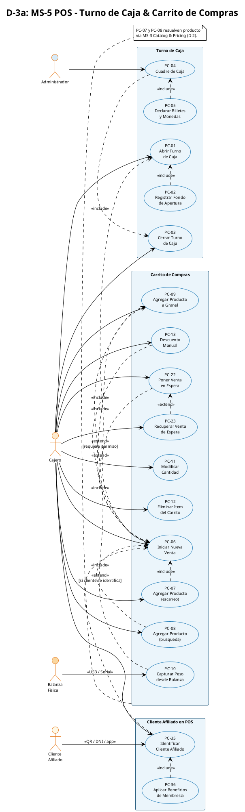
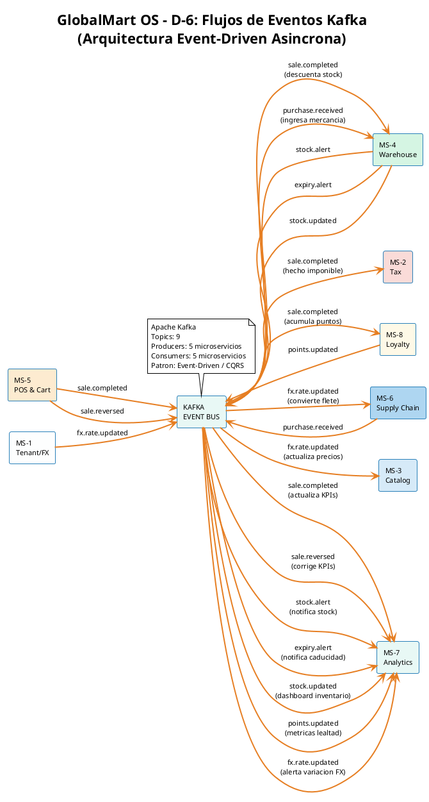

# GlobalMart OS — Diagramas de Casos de Uso v3.1
> **Formato:** 9 diagramas compactos · Copiar cada bloque `plantuml` por separado en [plantuml.com/plantuml/uml](https://www.plantuml.com/plantuml/uml/)

---

## Indice de Diagramas

| # | Diagrama | Microservicios |
|---|---|---|
| D-0 | Actores & Generalizacion de Roles | Vista global |
| D-1 | Identidad & Cumplimiento Fiscal | MS-1 + MS-2 |
| D-2 | Catalogo & Inventario | MS-3 + MS-4 |
| D-3a | POS — Turno de Caja & Carrito | MS-5 parte 1 |
| D-3b | POS — Cobro, Pagos & Devolucion | MS-5 parte 2 |
| D-4 | Cadena de Suministro | MS-6 |
| D-5a | Analytics & Notificaciones | MS-7 |
| D-5b | Loyalty & Customer Service | MS-8 |
| D-6 | Flujos Kafka (Eventos Asincronos) | Bus de eventos |

---

## D-0 · Actores & Generalizacion de Roles

> Muestra todos los actores del sistema y como un usuario puede ocupar multiples roles simultaneamente.

---

## D-1 · Identidad & Cumplimiento Fiscal

> **MS-1** Tenant & Identity Service + **MS-2** Tax & Compliance Service

```plantuml
@startuml D1_Identity_Tax
!theme plain
skinparam packageStyle rectangle
skinparam packageBorderColor #2C3E50
skinparam packageBackgroundColor #FDFEFE
skinparam usecaseBackgroundColor #EBF5FB
skinparam usecaseBorderColor #2980B9
skinparam actorBorderColor #E67E22
skinparam defaultFontSize 10
skinparam defaultFontName Arial
skinparam nodesep 35
skinparam ranksep 45
left to right direction

title GlobalMart OS - D-1: MS-1 Tenant/Identity + MS-2 Tax & Compliance

actor "Cajero"        as Cajero     #FDEBD0
actor "Administrador" as Admin      #D6EAF8
actor "Super_Admin"   as SuperAdmin #F9EBF0

package "MS-1 · Tenant & Identity Service" as MS1 {

  package "Autenticacion" as AUTH {
    usecase "TI-01\nIniciar Sesion" as TI01
    usecase "TI-02\nCerrar Sesion" as TI02
    usecase "TI-03\nAutenticar MFA" as TI03
  }

  package "Gestion de Usuarios" as USR {
    usecase "TI-04\nGestionar Perfil\nde Usuario" as TI04
    usecase "TI-05\nCrear/Editar/\nDesactivar Usuario" as TI05
    usecase "TI-06\nAsignar Roles\ny Permisos" as TI06
    usecase "TI-20\nAsignar Multiples\nRoles a Usuario" as TI20
    usecase "TI-21\nCambiar Rol\nActivo en Sesion" as TI21
    usecase "TI-22\nEscalar Rol\nTemporalmente" as TI22
    usecase "TI-23\nConfigurar Separacion\nde Funciones" as TI23
    usecase "TI-14\nAuditar Log\nde Accesos" as TI14
  }

  package "Configuracion Tenant" as TENANT {
    usecase "TI-07\nConfigurar Tenant\n(Localizacion)" as TI07
    usecase "TI-08\nDefinir Idioma" as TI08
    usecase "TI-09\nConfigurar\nMoneda Base" as TI09
    usecase "TI-10\nConfigurar Pais\ny Zona Horaria" as TI10
    usecase "TI-11\nGestionar\nSucursales" as TI11
  }

  package "Tipos de Cambio (FX)" as FX {
    usecase "TI-15\nObtener Tipo de\nCambio en Tiempo Real" as TI15
    usecase "TI-16\nActualizar Tabla\nde Tipos de Cambio" as TI16
    usecase "TI-17\nConvertir Monto\nentre Monedas" as TI17
    usecase "TI-18\nConfigurar Umbral\nActualizacion FX" as TI18
    usecase "TI-19\nRegistrar Historial\nde Tasas FX" as TI19
  }

  TI02 .> TI01 : <<include>>
  TI03 .> TI01 : <<extend>>\n[si MFA activo]
  TI04 .> TI01 : <<include>>
  TI05 .> TI04 : <<include>>
  TI06 .> TI04 : <<include>>
  TI20 .> TI06 : <<include>>
  TI21 .> TI01 : <<include>>
  TI22 .> TI21 : <<extend>>\n[una sola accion]
  TI23 .> TI06 : <<extend>>
  TI07 .> TI01 : <<include>>
  TI08 .> TI07 : <<include>>
  TI09 .> TI07 : <<include>>
  TI10 .> TI07 : <<include>>
  TI11 .> TI07 : <<include>>
  TI15 .> TI09 : <<include>>
  TI16 .> TI15 : <<include>>
  TI17 .> TI15 : <<include>>
  TI18 .> TI16 : <<extend>>\n[variacion > umbral]
  TI19 .> TI16 : <<include>>
}

package "MS-2 · Tax & Compliance Service" as MS2 {

  package "Calculo de Impuestos" as CALC {
    usecase "TC-01\nCalcular Impuesto\nde Venta" as TC01
    usecase "TC-02\nCalcular IVA\nCompuesto" as TC02
    usecase "TC-03\nExencion Fiscal\n(Producto)" as TC03
    usecase "TC-04\nExencion Fiscal\n(Cliente)" as TC04
    usecase "TC-05\nConfigurar Reglas\nFiscales por Pais" as TC05
  }

  package "Documentos Tributarios" as DTE {
    usecase "TC-06\nSolicitar Folio\nElectronico" as TC06
    usecase "TC-07\nValidar Folio con\nEntidad Fiscal" as TC07
    usecase "TC-08\nEmitir DTE" as TC08
    usecase "TC-09\nGenerar Boleta/\nFactura Electronica" as TC09
    usecase "TC-10\nManejar Rechazo\nde Folio" as TC10
    usecase "TC-11\nConsultar Estado\nde DTE" as TC11
    usecase "TC-12\nReporte Declaracion\nFiscal" as TC12
  }

  TC02 .> TC01 : <<include>>
  TC03 .> TC01 : <<extend>>\n[si producto exento]
  TC04 .> TC01 : <<extend>>\n[si cliente exento]
  TC06 .> TC01 : <<include>>
  TC07 .> TC06 : <<include>>
  TC08 .> TC06 : <<include>>
  TC09 .> TC06 : <<include>>
  TC09 .> TC07 : <<include>>
  TC10 .> TC07 : <<extend>>\n[si falla Fiscal]
}

actor "Entidad Fiscal\n(SII/AFIP/IRS)" as Fiscal    #FADBD8
actor "Servicio FX\n(Fixer.io)"       as FXService  #FDFEFE
actor "Kafka"                         as Kafka      #E8F8F5

Cajero     --> TI01
Cajero     --> TI21
Cajero     --> TI22
Cajero     --> TC04
Admin      --> TI04
Admin      --> TI05
Admin      --> TI06
Admin      --> TI07
Admin      --> TI11
Admin      --> TI17
Admin      --> TI18
Admin      --> TI20
Admin      --> TC05
Admin      --> TC11
Admin      --> TC12
Admin      --> TI14
SuperAdmin --> TI07
SuperAdmin --> TI11
SuperAdmin --> TI14
SuperAdmin --> TI23
FXService  --> TI15 : <<HTTP REST>>
Fiscal     --> TC07 : <<validacion>>
Fiscal     --> TC08 : <<DTE>>
TI16       --> Kafka : <<publish>>\nfx.rate.updated

@enduml
```

---

## D-2 · Catalogo & Inventario

> **MS-3** Catalog & Pricing Service + **MS-4** Warehouse & Inventory Service

```plantuml
@startuml D2_Catalog_Warehouse
!theme plain
skinparam packageStyle rectangle
skinparam packageBorderColor #2C3E50
skinparam packageBackgroundColor #FDFEFE
skinparam usecaseBackgroundColor #EBF5FB
skinparam usecaseBorderColor #2980B9
skinparam actorBorderColor #E67E22
skinparam defaultFontSize 10
skinparam defaultFontName Arial
skinparam nodesep 35
skinparam ranksep 45
left to right direction

title GlobalMart OS - D-2: MS-3 Catalog & Pricing + MS-4 Warehouse & Inventory

actor "Cajero"        as Cajero    #FDEBD0
actor "Reponedor"     as Reponedor #D5F5E3
actor "Administrador" as Admin     #D6EAF8

package "MS-3 · Catalog & Pricing Service" as MS3 {

  package "Gestion de Productos" as PROD {
    usecase "CP-01\nCrear Producto\nen Catalogo" as CP01
    usecase "CP-02\nEditar Producto" as CP02
    usecase "CP-03\nAsignar Codigo\nBarras / QR" as CP03
    usecase "CP-04\nEscanear Codigo\nBarras / QR" as CP04
    usecase "CP-05\nBuscar Producto" as CP05
    usecase "CP-15\nGestionar\nCategorias" as CP15
    usecase "CP-16\nExportar Catalogo\nCSV / Excel" as CP16
  }

  package "Unidades de Medida" as UOM {
    usecase "CP-06\nConfigurar UOM" as CP06
    usecase "CP-07\nConvertir Unidades\n(kg-lb, L-gal)" as CP07
    usecase "CP-08\nProducto a\nGranel (peso var.)" as CP08
    usecase "CP-09\nCapturar Peso\ndesde Balanza" as CP09
  }

  package "Precios & Promociones" as PRICE {
    usecase "CP-10\nDefinir Precio\nBase" as CP10
    usecase "CP-11\nPrecio Dinamico\n(reglas)" as CP11
    usecase "CP-12\nAplicar Descuento\n/ Promocion" as CP12
    usecase "CP-13\nDefinir Rango\nde Fechas Promo." as CP13
    usecase "CP-14\nPrecio por\nSucursal" as CP14
  }

  CP02 .> CP01 : <<include>>
  CP03 .> CP01 : <<include>>
  CP07 .> CP06 : <<include>>
  CP08 .> CP04 : <<include>>
  CP08 .> CP07 : <<extend>>
  CP09 .> CP08 : <<include>>
  CP11 .> CP10 : <<extend>>
  CP12 .> CP10 : <<extend>>\n[si hay promocion]
  CP13 .> CP12 : <<include>>
  CP14 .> CP10 : <<extend>>
}

package "MS-4 · Warehouse & Inventory Service" as MS4 {

  package "Stock & Ajustes" as STOCK {
    usecase "WI-01\nConsultar\nStock Actual" as WI01
    usecase "WI-02\nAjustar Stock\nManualmente" as WI02
    usecase "WI-03\nRegistrar Merma\n/ Perdida" as WI03
    usecase "WI-15\nTransferir Stock\nentre Sucursales" as WI15
  }

  package "Recepcion & FEFO" as RECV {
    usecase "WI-04\nRegistrar Recepcion\nde Mercancia" as WI04
    usecase "WI-05\nAplicar Regla\nFEFO" as WI05
    usecase "WI-06\nIngresar Fecha\nde Caducidad" as WI06
    usecase "WI-07\nAsignar Lote\na Nevera" as WI07
    usecase "WI-08\nControlar Volumen\nde Nevera" as WI08
  }

  package "Alertas & Conteo" as ALERT {
    usecase "WI-09\nGenerar Alerta\nStock Minimo" as WI09
    usecase "WI-10\nGenerar Alerta\nProx. Caducidad" as WI10
    usecase "WI-11\nConteo Fisico\nde Inventario" as WI11
    usecase "WI-12\nConciliar\nInventario" as WI12
  }

  package "Integracion Asincrona" as ASYNC {
    usecase "WI-13\nProcesar Evento\nsale.completed" as WI13
    usecase "WI-14\nDescontar Stock\npor Venta" as WI14
  }

  WI02 .> WI01 : <<include>>
  WI03 .> WI02 : <<include>>
  WI05 .> WI04 : <<include>>
  WI06 .> WI04 : <<include>>
  WI07 .> WI04 : <<include>>
  WI07 .> WI05 : <<extend>>\n[si perecedero]
  WI08 .> WI07 : <<include>>
  WI10 .> WI05 : <<include>>
  WI12 .> WI11 : <<include>>
  WI14 .> WI13 : <<include>>
}

actor "Balanza Fisica" as Balanza #FAD7A0
actor "Kafka"          as Kafka   #E8F8F5

Cajero    --> CP04
Cajero    --> CP05
Cajero    --> CP08
Cajero    --> WI01
Admin     --> CP01
Admin     --> CP02
Admin     --> CP03
Admin     --> CP06
Admin     --> CP10
Admin     --> CP11
Admin     --> CP12
Admin     --> CP14
Admin     --> CP15
Admin     --> CP16
Admin     --> WI01
Admin     --> WI02
Admin     --> WI12
Admin     --> WI15
Reponedor --> CP03
Reponedor --> CP04
Reponedor --> WI03
Reponedor --> WI04
Reponedor --> WI06
Reponedor --> WI07
Reponedor --> WI11
Balanza   --> CP09 : <<USB/Serial>>
Kafka     --> WI13 : <<consume>>\nsale.completed
WI09      --> Kafka : <<publish>>\nstock.alert
WI10      --> Kafka : <<publish>>\nexpiry.alert
WI14      --> Kafka : <<publish>>\nstock.updated

@enduml
```

---

## D-3a · POS — Turno de Caja & Carrito

> **MS-5** (parte 1/2) — Apertura de turno, carrito, granel e identificacion de cliente afiliado

---

## D-3b · POS — Cobro, Pagos & Devolucion

> **MS-5** (parte 2/2) — Calculo de total, metodos de pago, terminal POS, pasarela y eventos Kafka

```plantuml
@startuml D3b_Cobro_Pagos
!theme plain
skinparam packageStyle rectangle
skinparam packageBorderColor #1A5276
skinparam packageBackgroundColor #FDFEFE
skinparam usecaseBackgroundColor #EBF5FB
skinparam usecaseBorderColor #2980B9
skinparam actorBackgroundColor #FDEBD0
skinparam actorBorderColor #E67E22
skinparam defaultFontSize 10
skinparam defaultFontName Arial
skinparam nodesep 35
skinparam ranksep 45
left to right direction

title D-3b: MS-5 POS - Cobro, Pagos & Devolucion

actor "Cajero"        as Cajero #FDEBD0
actor "Administrador" as Admin  #D6EAF8

package "Calculo & Metodos de Cobro" as COBRO #EBF5FB {
  usecase "PC-14\nCalcular Total\ncon Impuestos" as PC14
  usecase "PC-15\nCobrar en\nEfectivo" as PC15
  usecase "PC-16\nCalcular\nVuelto" as PC16
  usecase "PC-17\nCobrar con\nTarjeta" as PC17
  usecase "PC-18\nPago Mixto" as PC18
}

package "Terminal & Pasarela de Pago" as HW #EBF5FB {
  usecase "PC-26\nLeer Tarjeta\n(NFC/chip/mag)" as PC26
  usecase "PC-27\nEnviar Solicitud\na Pasarela" as PC27
  usecase "PC-28\nRecibir Respuesta\nde Pasarela" as PC28
  usecase "PC-29\nManejar Rechazo\nde Pago" as PC29
  usecase "PC-32\nAbrir Cajon\nde Dinero" as PC32
  usecase "PC-34\nMostrar Total\nen Display" as PC34
}

package "Comprobante & Devolucion" as DEV #EBF5FB {
  usecase "PC-19\nEmitir Recibo /\nComprobante" as PC19
  usecase "PC-33\nImprimir Recibo\nen Terminal" as PC33
  usecase "PC-20\nAnular Venta\n(Devolucion)" as PC20
  usecase "PC-21\nDevolucion\nParcial" as PC21
  usecase "PC-30\nSolicitar Reembolso\na Pasarela" as PC30
  usecase "PC-31\nConfirmar\nReembolso" as PC31
}

package "Eventos Kafka" as EVT #EBF5FB {
  usecase "PC-24\nPublicar\nsale.completed" as PC24
  usecase "PC-25\nPublicar\nsale.reversed" as PC25
  usecase "PC-37\nAcumular Puntos\ntras Venta" as PC37
}

actor "Terminal\nPOS"     as Terminal #A9DFBF
actor "Pasarela\nde Pago" as Pasarela #D2B4DE
actor "Kafka"             as Kafka    #E8F8F5

PC15 .> PC14 : <<include>>
PC16 .> PC15 : <<include>>
PC17 .> PC14 : <<include>>
PC18 .> PC15 : <<include>>
PC18 .> PC17 : <<include>>
PC26 .> PC17 : <<include>>
PC27 .> PC17 : <<include>>
PC28 .> PC27 : <<include>>
PC29 .> PC28 : <<extend>>\n[pasarela rechaza]
PC32 .> PC15 : <<include>>
PC34 .> PC14 : <<include>>
PC19 .> PC14 : <<include>>
PC33 .> PC19 : <<include>>
PC20 .> PC19 : <<extend>>\n[requiere permiso]
PC21 .> PC20 : <<include>>
PC30 .> PC20 : <<include>>
PC31 .> PC30 : <<include>>
PC24 .> PC19 : <<include>>
PC25 .> PC20 : <<include>>
PC37 .> PC24 : <<include>>

Cajero   --> PC14
Cajero   --> PC15
Cajero   --> PC17
Cajero   --> PC18
Cajero   --> PC20
Cajero   --> PC29
Admin    --> PC20
Terminal --> PC26 : <<lector>>
Terminal --> PC32 : <<cajon>>
Terminal --> PC33 : <<impresora>>
Terminal --> PC34 : <<display>>
Pasarela --> PC28 : <<respuesta pago>>
Pasarela --> PC31 : <<respuesta reembolso>>
PC24     --> Kafka : <<publish>>\nsale.completed
PC25     --> Kafka : <<publish>>\nsale.reversed

note bottom of EVT
  PC-19 invoca generacion de boleta
  via MS-2 Tax & Compliance (D-1).
end note

@enduml
```

---

## D-4 · Cadena de Suministro

> **MS-6** Supply Chain & Import Service — Ordenes de compra, Landed Cost y Transporte

```plantuml
@startuml D4_SupplyChain
!theme plain
skinparam packageStyle rectangle
skinparam packageBorderColor #2C3E50
skinparam packageBackgroundColor #FDFEFE
skinparam usecaseBackgroundColor #EBF5FB
skinparam usecaseBorderColor #2980B9
skinparam actorBorderColor #E67E22
skinparam defaultFontSize 10
skinparam defaultFontName Arial
skinparam nodesep 35
skinparam ranksep 45
left to right direction

title GlobalMart OS - D-4: MS-6 Supply Chain & Import Service

actor "Administrador" as Admin     #D6EAF8
actor "Reponedor"     as Reponedor #D5F5E3

package "Ordenes de Compra" as OC #EBF5FB {
  usecase "SC-01\nCrear Orden\nde Compra" as SC01
  usecase "SC-02\nSeleccionar\nProveedor" as SC02
  usecase "SC-03\nAgregar Items\na Orden" as SC03
  usecase "SC-04\nAprobar Orden\nde Compra" as SC04
  usecase "SC-05\nEnviar Orden\na Proveedor" as SC05
}

package "Costo Landed" as LANDED #EBF5FB {
  usecase "SC-06\nCalcular Costo\nLanded" as SC06
  usecase "SC-07\nIngresar Costos\nde Flete" as SC07
  usecase "SC-08\nIngresar Aranceles\ne Impuestos" as SC08
  usecase "SC-09\nIngresar Seguros\ny Gastos Aduaneros" as SC09
  usecase "SC-24\nConvertir Costo Flete\na Moneda Local" as SC24
}

package "Gestion de Importaciones" as IMPORT #EBF5FB {
  usecase "SC-10\nRegistrar\nImportacion" as SC10
  usecase "SC-11\nActualizar Estado\nImportacion" as SC11
  usecase "SC-12\nConfirmar Recepcion\nde Importacion" as SC12
}

package "Transporte & Logistica" as TRANSP #EBF5FB {
  usecase "SC-18\nSolicitar Cotizacion\nde Flete" as SC18
  usecase "SC-19\nComparar Ofertas\nde Flete" as SC19
  usecase "SC-20\nConfirmar\nTransportista" as SC20
  usecase "SC-21\nRastrear Envio\n(Tracking)" as SC21
  usecase "SC-22\nConfirmar Entrega\nen Destino" as SC22
  usecase "SC-23\nGestionar Incidencia\nde Transporte" as SC23
}

package "Proveedores" as PROV #EBF5FB {
  usecase "SC-14\nGestionar Catalogo\nde Proveedores" as SC14
  usecase "SC-15\nCrear / Editar\nProveedor" as SC15
  usecase "SC-16\nEvaluar Historial\nde Proveedor" as SC16
}

actor "Sistema de\nTransporte (3PL)" as Transporte #AED6F1
actor "Kafka"                        as Kafka      #E8F8F5

SC02 .> SC01 : <<include>>
SC03 .> SC01 : <<include>>
SC04 .> SC01 : <<include>>
SC05 .> SC04 : <<include>>
SC06 .> SC01 : <<include>>
SC07 .> SC06 : <<include>>
SC08 .> SC06 : <<include>>
SC09 .> SC06 : <<include>>
SC24 .> SC07 : <<include>>
SC11 .> SC10 : <<include>>
SC12 .> SC10 : <<include>>
SC18 .> SC07 : <<include>>
SC19 .> SC18 : <<include>>
SC20 .> SC19 : <<include>>
SC21 .> SC10 : <<include>>
SC22 .> SC21 : <<include>>
SC23 .> SC21 : <<extend>>\n[retraso/siniestro]
SC15 .> SC14 : <<include>>
SC16 .> SC14 : <<include>>

Admin      --> SC01
Admin      --> SC04
Admin      --> SC06
Admin      --> SC07
Admin      --> SC08
Admin      --> SC09
Admin      --> SC10
Admin      --> SC14
Admin      --> SC15
Admin      --> SC19
Admin      --> SC20
Admin      --> SC21
Admin      --> SC23
Reponedor  --> SC12
Reponedor  --> SC22
Transporte --> SC18 : <<cotizacion API>>
Transporte --> SC21 : <<tracking API>>
Transporte --> SC22 : <<confirmacion>>
SC12       --> Kafka : <<publish>>\npurchase.received

@enduml
```

---

## D-5a · Analytics & Notificaciones

> **MS-7** Analytics & Notification Service — Dashboards, reportes, alertas y canales de mensajeria

```plantuml
@startuml D5a_Analytics
!theme plain
skinparam packageStyle rectangle
skinparam packageBorderColor #1A5276
skinparam packageBackgroundColor #FDFEFE
skinparam usecaseBackgroundColor #EBF5FB
skinparam usecaseBorderColor #2980B9
skinparam actorBackgroundColor #FDEBD0
skinparam actorBorderColor #E67E22
skinparam defaultFontSize 10
skinparam defaultFontName Arial
skinparam nodesep 35
skinparam ranksep 45
left to right direction

title D-5a: MS-7 Analytics & Notification Service

actor "Administrador" as Admin      #D6EAF8
actor "Reponedor"     as Reponedor  #D5F5E3
actor "Super_Admin"   as SuperAdmin #F9EBF0

package "Dashboards & Reportes" as DASH #EBF5FB {
  usecase "AN-01\nDashboard\nde Ventas" as AN01
  usecase "AN-02\nFiltrar por\nPeriodo" as AN02
  usecase "AN-03\nFiltrar por\nSucursal" as AN03
  usecase "AN-04\nDashboard\nde Inventario" as AN04
  usecase "AN-05\nDashboard\nFinanciero" as AN05
  usecase "AN-06\nGenerar Reporte\nde Ventas" as AN06
  usecase "AN-07\nTop Productos\nMas Vendidos" as AN07
  usecase "AN-08\nReporte\nde Mermas" as AN08
  usecase "AN-09\nExportar\nPDF / Excel" as AN09
  usecase "AN-16\nKPIs en\nTiempo Real" as AN16
  usecase "AN-17\nAuditar Log\nde Eventos" as AN17
}

package "Alertas & Despacho" as NOTIF #EBF5FB {
  usecase "AN-12\nAlerta Stock\nMinimo" as AN12
  usecase "AN-13\nAlerta Prox.\nCaducidad" as AN13
  usecase "AN-14\nConfigurar\nUmbrales" as AN14
  usecase "AN-15\nDespachar\nNotificacion" as AN15
  usecase "AN-24\nAlerta Variacion\nTipo de Cambio" as AN24
}

package "Canales de Mensajeria" as CANAL #EBF5FB {
  usecase "AN-18\nEnviar SMS" as AN18
  usecase "AN-19\nEnviar Email" as AN19
  usecase "AN-20\nEnviar\nNotif. Push" as AN20
  usecase "AN-21\nConfigurar\nPlantillas" as AN21
  usecase "AN-22\nHistorial\nde Envios" as AN22
  usecase "AN-23\nManejar Fallo\nde Entrega" as AN23
}

package "Consumo de Eventos" as CONSUME #EBF5FB {
  usecase "AN-10\nConsumir\nsale.completed" as AN10
  usecase "AN-11\nConsumir\nstock.updated" as AN11
}

actor "Kafka"                        as Kafka      #E8F8F5
actor "Proveedor\nMensajeria\n(Twilio/SendGrid)" as Mensajeria #A3E4D7

AN02 .> AN01 : <<extend>>
AN03 .> AN01 : <<extend>>
AN06 .> AN01 : <<include>>
AN07 .> AN06 : <<include>>
AN09 .> AN06 : <<extend>>
AN16 .> AN10 : <<include>>
AN15 .> AN12 : <<include>>
AN15 .> AN13 : <<include>>
AN18 .> AN15 : <<include>>
AN19 .> AN15 : <<include>>
AN20 .> AN15 : <<include>>
AN21 .> AN18 : <<extend>>
AN22 .> AN18 : <<include>>
AN22 .> AN19 : <<include>>
AN23 .> AN18 : <<extend>>\n[si falla provider]
AN24 .> AN19 : <<include>>

Admin      --> AN01
Admin      --> AN04
Admin      --> AN05
Admin      --> AN06
Admin      --> AN07
Admin      --> AN08
Admin      --> AN09
Admin      --> AN14
Admin      --> AN16
Admin      --> AN21
Admin      --> AN24
Admin      --> AN12
Reponedor  --> AN04
Reponedor  --> AN12
Reponedor  --> AN13
SuperAdmin --> AN17

Kafka      --> AN10 : <<consume>>\nsale.completed
Kafka      --> AN11 : <<consume>>\nstock.updated
Kafka      --> AN12 : <<consume>>\nstock.alert
Kafka      --> AN13 : <<consume>>\nexpiry.alert
Mensajeria --> AN18 : <<entrega SMS>>
Mensajeria --> AN19 : <<entrega Email>>
Mensajeria --> AN20 : <<entrega Push>>

@enduml
```

---

## D-5b · Loyalty & Customer Service

> **MS-8** Loyalty & Customer Service — Registro, puntos, canje, membresia y cupones

```plantuml
@startuml D5b_Loyalty
!theme plain
skinparam packageStyle rectangle
skinparam packageBorderColor #1A5276
skinparam packageBackgroundColor #FDFEFE
skinparam usecaseBackgroundColor #EBF5FB
skinparam usecaseBorderColor #2980B9
skinparam actorBackgroundColor #FDEBD0
skinparam actorBorderColor #E67E22
skinparam defaultFontSize 10
skinparam defaultFontName Arial
skinparam nodesep 35
skinparam ranksep 45
left to right direction

title D-5b: MS-8 Loyalty & Customer Service

actor "Cajero"        as Cajero #FDEBD0
actor "Administrador" as Admin  #D6EAF8

package "Registro & Perfil" as PROFILE #EBF5FB {
  usecase "LC-01\nRegistrar Cliente\nAfiliado" as LC01
  usecase "LC-02\nVerificar Identidad\ndel Cliente" as LC02
  usecase "LC-03\nIdentificar Cliente\nen POS" as LC03
  usecase "LC-04\nConsultar Perfil\ny Saldo de Puntos" as LC04
  usecase "LC-05\nVer Historial\nde Compras" as LC05
}

package "Acumulacion & Canje" as POINTS #EBF5FB {
  usecase "LC-06\nAcumular Puntos\npor Compra" as LC06
  usecase "LC-07\nCanjear Puntos\npor Descuento" as LC07
  usecase "LC-08\nCanjear Puntos\npor Producto Gratis" as LC08
  usecase "LC-15\nExpirar Puntos\nInactivos" as LC15
  usecase "LC-17\nPublicar\npoints.updated" as LC17
}

package "Membresia & Cupones" as MEMBER #EBF5FB {
  usecase "LC-09\nAplicar Tier /\nNivel Membresia" as LC09
  usecase "LC-10\nEmitir Cupon\nde Descuento" as LC10
  usecase "LC-11\nValidar Cupon\nen POS" as LC11
  usecase "LC-12\nConfigurar Programa\nde Lealtad" as LC12
  usecase "LC-13\nDefinir Multiplicadores\nde Puntos" as LC13
  usecase "LC-14\nDefinir Beneficios\npor Nivel" as LC14
}

package "Comunicacion" as COMM #EBF5FB {
  usecase "LC-16\nEnviar Estado de\nCuenta al Cliente" as LC16
}

actor "Cliente\nAfiliado"     as Cliente   #FEF9E7
actor "Kafka"                 as Kafka     #E8F8F5
actor "Proveedor\nMensajeria" as Mensajeria #A3E4D7

LC02 .> LC01 : <<include>>
LC04 .> LC03 : <<include>>
LC05 .> LC03 : <<include>>
LC07 .> LC03 : <<include>>
LC08 .> LC04 : <<include>>
LC09 .> LC03 : <<include>>
LC10 .> LC09 : <<include>>
LC11 .> LC10 : <<include>>
LC13 .> LC12 : <<include>>
LC14 .> LC12 : <<include>>
LC15 .> LC06 : <<extend>>\n[> 12 meses inactivo]
LC16 .> LC04 : <<include>>
LC17 .> LC06 : <<include>>
LC17 .> LC07 : <<include>>

Cajero  --> LC01
Cajero  --> LC03
Cajero  --> LC07
Cajero  --> LC08
Cajero  --> LC11
Admin   --> LC01
Admin   --> LC12
Admin   --> LC13
Admin   --> LC14
Cliente --> LC03 : <<QR / DNI / app>>
Cliente --> LC04
Cliente --> LC05
Cliente --> LC07
Cliente --> LC08

Kafka    --> LC06 : <<consume>>\nsale.completed
LC17     --> Kafka : <<publish>>\npoints.updated
LC16     --> Mensajeria : <<envio email>>

note bottom of COMM
  LC-16 usa el canal Email
  del MS-7 Analytics (ver D-5a).
end note

@enduml
```

---

## D-6 · Flujos Kafka (Eventos Asincronos)

> Vista de alto nivel del Bus de Eventos entre los 8 microservicios

---

## Guia de Renderizado

| Herramienta | Instruccion |
|---|---|
| Online | [plantuml.com/plantuml/uml](https://www.plantuml.com/plantuml/uml/) — pegar cada bloque |
| VS Code | Extension **PlantUML** (jebbs.plantuml) — `Alt+D` para preview |
| CLI | `java -jar plantuml.jar archivo.puml` |
